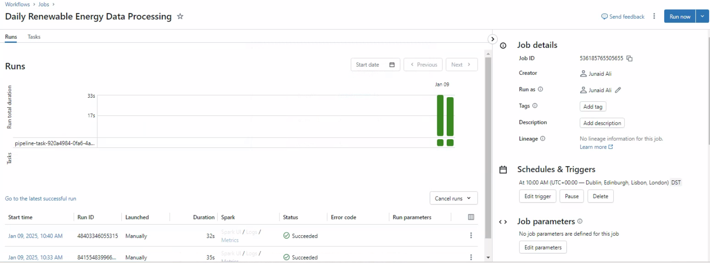

# Colibri Coding Challenge

Challenge Details
---------------
Consider the following scenario:

You are a data engineer for a renewable energy company that operates a farm of wind turbines. The turbines generate power based on wind speed and direction, and their output is measured in megawatts (MW). Your task is to build a data processing pipeline that ingests raw data from the turbines and performs the following operations:

- Cleans the data: The raw data contains missing values and outliers, which must be removed or imputed.
- Calculates summary statistics: For each turbine, calculate the minimum, maximum, and average power output over a given time period (e.g., 24 hours).
- Identifies anomalies: Identify any turbines that have significantly deviated from their expected power output over the same time period. Anomalies can be defined as turbines whose output is outside of 2 standard deviations from the mean.
- Stores the processed data: Store the cleaned data and summary statistics in a database for further analysis.

Data is provided to you as CSVs which are appended daily. Due to the way the turbine measurements are set up, each csv contains data for a group of 5 turbines. Data for a particular turbine will always be in the same file (e.g. turbine 1 will always be in data_group_1.csv). Each day the csv will be updated with data from the last 24 hours, however the system is known to sometimes miss entries due to sensor malfunctions.

The files provided in the attachment represent a valid set for a month of data recorded from the 15 turbines. Feel free to add/remove data from the set provided in order to test/satisfy the requirements above.

Your pipeline should be scalable and testable; emphasis is based on the clarity and quality of the code and the implementation of the functionality outlined above, and not on the overall design of the application.

Your solution should be implemented in Python and Pyspark, using any frameworks or libraries that you deem appropriate. Please provide a brief description of your solution design and any assumptions made in your implementation.

Solution Design Description
---------------
This solution is a data processing pipeline implemented using Delta Live Tables declarative ETL framework, medallion architecture design pattern is used for multiple stages to process wind turbine data effectively.
The modular design ensures each stage (ingestion, cleaning, aggregation, anomaly detection) is logically separated for clarity and maintainability.
Using Delta Live Tables provides reliable, declarative pipeline management with automated tracking and monitoring.

Pipeline
---------------
[Pipeline](src/Process_Energy_Data.py) is divided in three stages/layers Bronze, Silver and Gold.

Bronze layer represent the raw source data which is processed incrementally.

Silver represent the clean data as per the challenge requirement, where data containing missing values and outliers is removed and clean data is persisted for further analysis.

Gold layer represent daily summary statistics and anomaly data.

Orchestration
---------------
Databricks [Job Workflow](src/Orchestration_job.json) is used to Orchestrate DLT job on a given schedule, which provides lineage, notification, retry mechanism and scalability out of the box.

Data
---------------
Cleansed and aggregated data is stored in form of delta table within Unity Catalog of Databricks for further analytics.

Assumptions
-----------
Power output must be between 0 and 10 MW

Wind speed must be between 0 and 100

Wind direction must be between 0 and 360 degrees

Testing
-----------
Data is manually changed for testing e.g. Wind direction is changed to >360 and wind to > 100 to test the pipelines handling of data quality checks/constraints.
